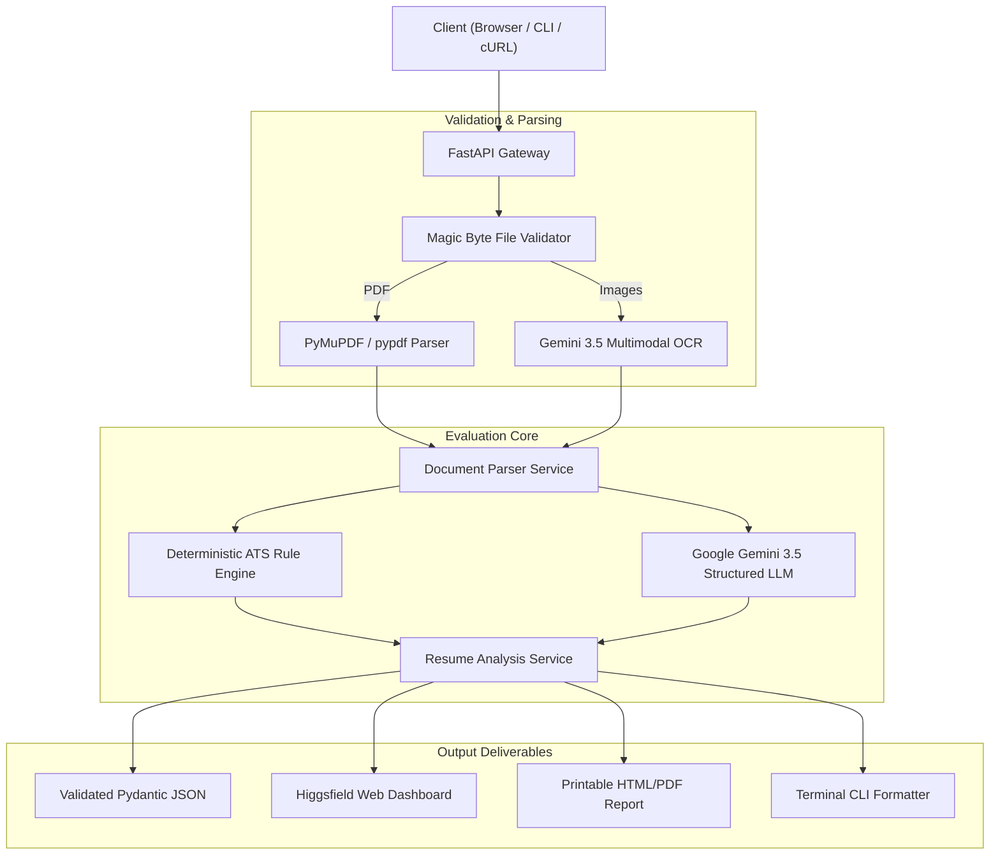

# AI Resume Analyzer & ATS Optimizer

<div align="center">

[](https://github.com/tokumag/ai-resume-analyzer/actions/workflows/ci.yml)
[](https://www.python.org/)
[](https://fastapi.tiangolo.com/)
[](https://aistudio.google.com/)
[](https://pytest.org/)
[](https://github.com/tokumag/ai-resume-analyzer/actions)
[](https://www.docker.com/)
[](https://github.com/tokumag/ai-resume-analyzer)
[](LICENSE)

**An intelligent, production-grade ATS resume evaluation and optimization engine powered by Google Gemini 3.5 Multimodal Vision, FastAPI, and deterministic heuristic algorithms.**

[Live Web Dashboard](#-interactive-web-dashboard) • [Quick Start](#-quick-start) • [CLI Usage](#-command-line-interface-cli) • [API Reference](#-api-endpoints) • [Architecture](#-architecture)

</div>

---

## 🌟 Overview

**AI Resume Analyzer** provides job seekers and technical recruiters with actionable, data-driven feedback on resumes. It combines **deterministic ATS compliance checks** (formatting, page density, contact info, buzzword detection) with **multimodal AI evaluation** (0–100 scoring across 5 dimensions, bullet rewrites, keyword gap analysis, and candidate benchmarking).

Accepts both **native PDFs** and **high-resolution images (`.PNG`, `.JPG`, `.JPEG`, `.WEBP`)** via Gemini Vision OCR.

---

## ✨ Key Features

| Feature | Description |
|---|---|
| 📄 **Multi-Format Processing** | Dual-engine PDF parsing (`PyMuPDF` + `pypdf`) and Multimodal Gemini OCR for image resumes (`PNG`, `JPG`, `WEBP`). |
| 🛡️ **Magic Byte Validation** | Rigorous binary signature checks for PDF, PNG, JPEG, and WEBP uploads to reject corrupted or spoofed files. |
| 🎯 **0–100 Holistic Scoring** | Multi-dimensional scoring across **Impact & Metrics**, **Brevity**, **Style**, **Structure**, and **Skills Alignment**. |
| 🤖 **Deterministic ATS Engine** | 8 automated rule checks evaluating contact details, standard headers, word density, quantified metrics, and cliché/buzzword detection. |
| ✍️ **High-Impact Bullet Rewrites** | Concrete before/after examples replacing passive phrasing with active, quantified achievement statements. |
| 🔍 **Keyword Gap Analysis** | Compares resume contents against target role requirements to identify found, missing, and recommended skills. |
| 👥 **Candidate Benchmarking** | Concurrently analyzes multiple candidate resumes, scoring and ranking them against target job descriptions. |
| 🖨️ **Printable Report Generator** | Generates clean, standalone printable HTML/PDF reports with embedded score meters and diff tables. |
| 🎨 **Higgsfield AI Theme** | Ultra-modern dark obsidian dashboard with radiant solar flame accents, animated score rings, and filterable checklists. |
| 💻 **Full-Featured CLI** | Inspect, parse, and analyze resumes directly from your terminal with JSON and formatted outputs. |

---

## 🏗️ Architecture



---

## 🚀 Quick Start

### 1. Prerequisites
- **Python 3.11+** (Python 3.12 recommended)
- A **Google Gemini API Key** from [Google AI Studio](https://aistudio.google.com/)

### 2. Installation (Local)

```bash
# Clone repository
git clone https://github.com/tokumag/ai-resume-analyzer.git
cd ai-resume-analyzer

# Create virtual environment
python -m venv .venv
source .venv/bin/activate  # On Windows: .venv\Scripts\Activate.ps1

# Install in editable mode with development tools
pip install -e .[dev]
```

### 3. Configure Environment

```bash
cp .env.example .env
```

Edit `.env`:
```ini
APP_ENV=development
APP_HOST=0.0.0.0
APP_PORT=8000

GEMINI_API_KEY=your_gemini_api_key_here
GEMINI_MODEL=gemini-3.5-flash
MAX_FILE_SIZE_MB=10
```

### 4. Run the Application

```bash
# Start server with auto-reload
python -m uvicorn resume_analyzer.main:app --host 0.0.0.0 --port 8000 --reload

# Or use npm scripts
npm run dev
```

Open **[http://localhost:8000/](http://localhost:8000/)** in your browser.

---

## 🐳 Docker Deployment

### Using Docker Compose

```bash
# Set your API key in .env, then run:
docker-compose up -d --build
```

### Using Docker CLI

```bash
docker build -t ai-resume-analyzer:latest .
docker run -d -p 8000:8000 --env-file .env --name resume-analyzer ai-resume-analyzer:latest
```

The application will be live at `http://localhost:8000/`.

---

## 💻 Command Line Interface (CLI)

The package exposes a full-featured CLI:

```bash
# 1. Full AI Resume Analysis
python -m resume_analyzer.cli analyze resume.pdf --role "Senior Backend Engineer" --output report.json

# 2. Analyze an Image Resume
python -m resume_analyzer.cli analyze resume_screenshot.png --role "Fullstack Developer"

# 3. Fast Text & Section Extraction (No LLM required)
python -m resume_analyzer.cli parse resume.pdf --output parsed.json

# 4. Start the API Server
python -m resume_analyzer.cli serve --host 127.0.0.1 --port 8000 --reload
```

---

## 🔌 API Endpoints

| Method | Endpoint | Description |
|---|---|---|
| `POST` | `/api/v1/analyze` | Full AI analysis (PDF / PNG / JPG / WEBP) with ATS checks & scoring. |
| `POST` | `/api/v1/parse` | Fast document parsing without LLM invocation. |
| `POST` | `/api/v1/compare` | Multi-candidate resume benchmarking and ranking. |
| `POST` | `/api/v1/export/report` | Standalone printable HTML report generation. |
| `GET` | `/health` | System health check and model connectivity status. |
| `GET` | `/docs` | Interactive Swagger API documentation. |

### cURL Example: Analyze Resume

```bash
curl -X POST "http://localhost:8000/api/v1/analyze" \
  -F "file=@/path/to/resume.pdf" \
  -F "target_role=Senior Software Engineer" \
  -F "job_description=FastAPI, Docker, PostgreSQL, AWS required."
```

---

## 🧪 Testing & Quality Gates

The project maintains **100% test pass rate** and strict static typing:

```bash
# Run 66+ unit and integration tests with coverage
pytest --cov=resume_analyzer --cov-fail-under=80

# Linting & code formatting
ruff check src/ tests/
ruff format --check src/ tests/

# Strict type checking
mypy src/

# Run complete quality suite
npm test
npm run build
```

---

## ⚙️ Configuration Reference

| Environment Variable | Default | Description |
|---|---|---|
| `APP_ENV` | `development` | Environment mode (`development`, `production`, `testing`). |
| `APP_HOST` | `0.0.0.0` | Binding host address. |
| `APP_PORT` | `8000` | Port for the HTTP server. |
| `APP_LOG_LEVEL` | `INFO` | Logging level (`DEBUG`, `INFO`, `WARNING`, `ERROR`). |
| `GEMINI_API_KEY` | *(Required)* | Google Gemini API key. |
| `GEMINI_MODEL` | `gemini-3.5-flash` | Active Gemini model ID. |
| `MAX_FILE_SIZE_MB` | `10` | Maximum upload size in megabytes. |

---

## 📂 Project Structure

```
ai-resume-analyzer/
├── .github/
│   ├── workflows/ci.yml           # CI/CD Automated Test Matrix (Python 3.11 & 3.12)
│   ├── ISSUE_TEMPLATE/            # Bug report & feature request templates
│   └── PULL_REQUEST_TEMPLATE.md   # Pull request review checklist
├── src/resume_analyzer/
│   ├── api/                       # FastAPI router, dependencies & middleware
│   ├── core/                      # Settings, logging, and custom exception hierarchy
│   ├── models/                    # Pydantic schemas (AnalysisResult, ParsedResume, etc.)
│   ├── services/
│   │   ├── analyzer.py            # Main evaluation orchestration service
│   │   ├── comparison.py          # Candidate benchmarking & ranking service
│   │   ├── parser.py              # PDF extraction & Gemini Vision OCR service
│   │   ├── reporter.py            # Printable HTML/PDF report generator
│   │   └── llm/                   # BaseLLMClient, GeminiClient & structured prompts
│   ├── static/                    # Higgsfield AI Single-Page Web Dashboard
│   ├── utils/                     # Magic bytes file validation & MIME detection
│   ├── cli.py                     # Command-line interface
│   └── main.py                    # FastAPI application bootstrap
├── tests/
│   ├── fixtures/                  # Mock resumes and sample PDF generators
│   ├── integration/               # FastAPI endpoint integration tests
│   └── unit/                      # Unit tests for parser, analyzer, LLM, CLI, and reporter
├── Dockerfile                     # Multi-stage production container
├── docker-compose.yml             # Local Docker Compose setup
├── package.json                   # NPM developer workflow scripts
├── pyproject.toml                 # Packaging, dependencies, and tool configurations
└── README.md                      # Project documentation
```

---

## 📄 License

Distributed under the **MIT License**. See [`LICENSE`](LICENSE) for details.
